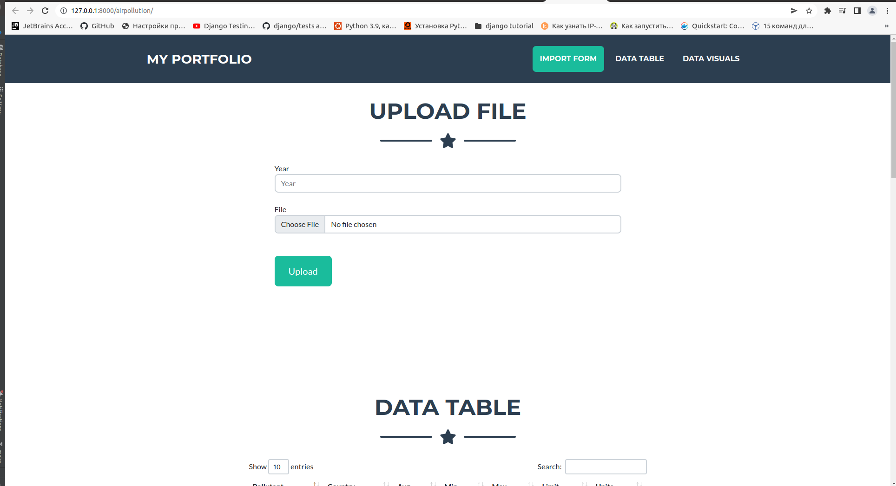
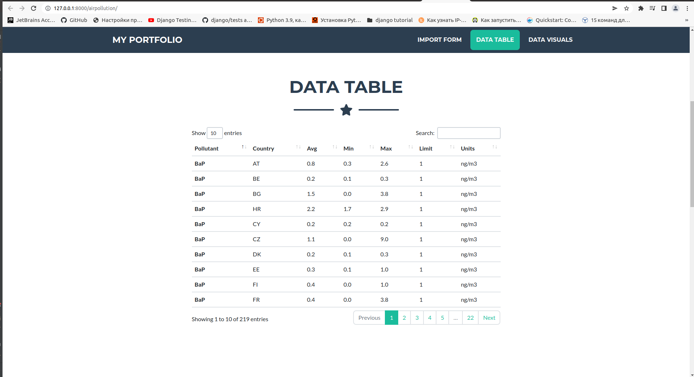
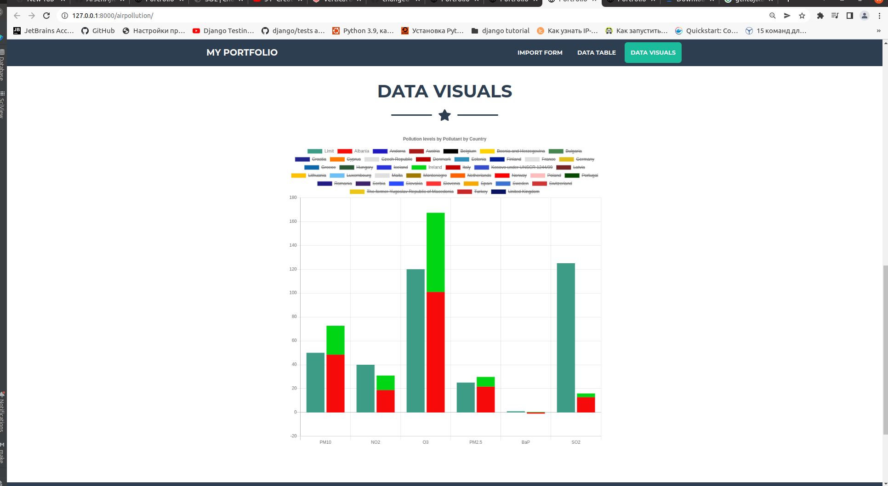

Data Analysis
====

## Start use sqlite3

```shell
   pip3 install -r requirements.txt
   python3 manage.py migrate
   python3 manage.py createsuperuser 
```

1. Create "country" - Open a browser to `http://127.0.0.1:8000/airpollution/temp_country_creator/` 
2. Update color in "country" - Open a browser to `http://127.0.0.1:8000/airpollution/temp_country_creator/?update=true` 
3. Update "pollutant" -  `http://127.0.0.1:8000/airpollution/temp_add_colors_to_pollutants`
4. Open a browser to `http://127.0.0.1:8000/airpollution/` to open the admin site  
5. Upload data (3 exel files) from  'data_for_project/excel_files/' 


1. Upload Data

   
   
2. Table Data

   

3. Visual Data

   

